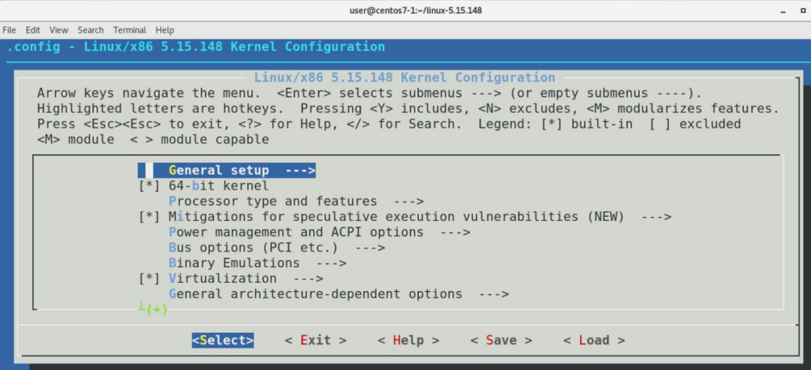
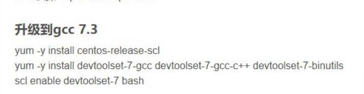

# Kernel Update
1. ``` uname -r```
2. ``` wget https://cdn.kernel.org/pub/linux/kernel/v5.x/linux-5.15.148.tar.xz```
3. ``` tar xvJf linux-5.15.148.tar.xz ```
4. Install neccessities:
```
yum install -y ncurses-devel make gcc bc bison flex elfutils-libelf-devel openssl-devel grub2
```
5.
```
cd linux-5.15.148/
cp -v /boot/config-5.14.0-419.el9.aarch64 .config
```
6. ``` make menuconfig```
7. 
8. Type the following command:
```
make bzImage
make modules
make
make modules_install
make install
grub2-mkconfig -o /boot/grub2/grub.cfg
reboot
```
# If you have errors makemenuconfig:
