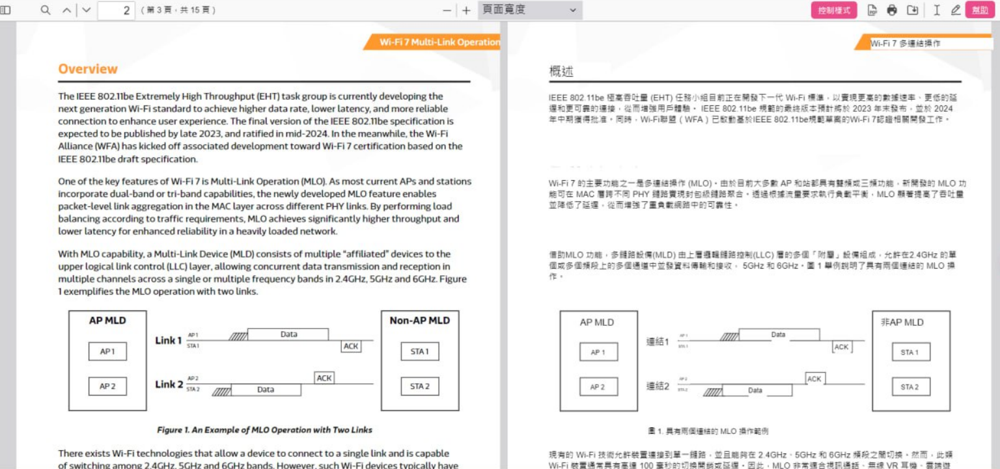
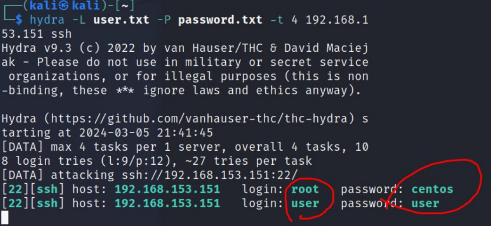
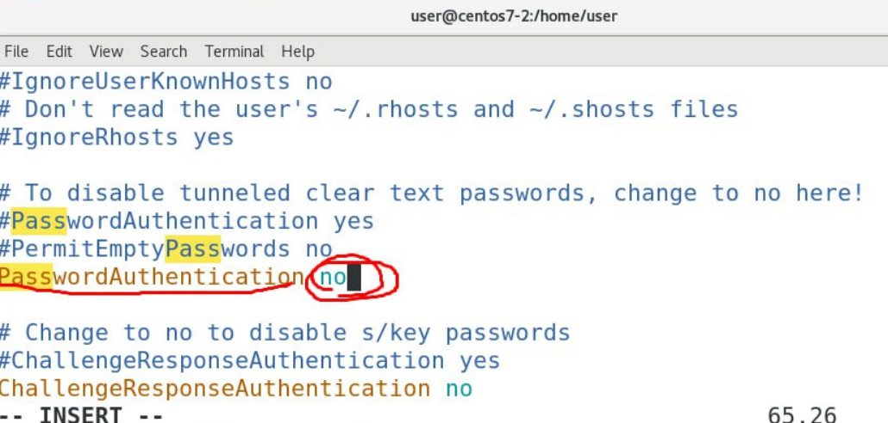
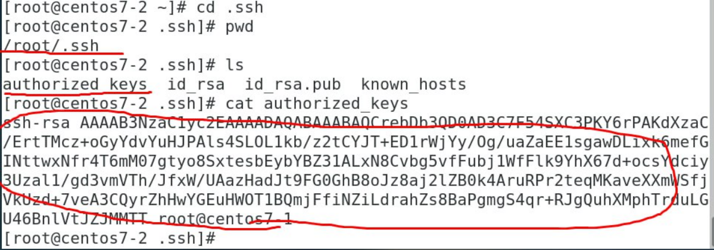
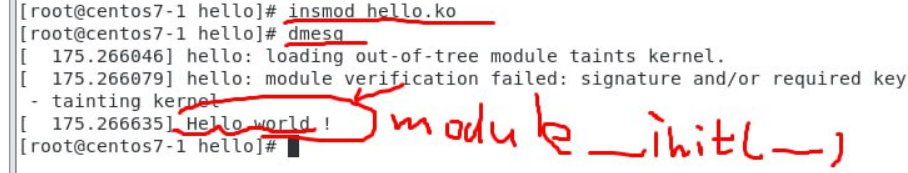
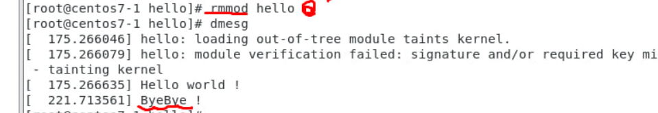

# Immersive Translate Extension: (useful)

``` This extension will help translate PDF file into your comfortable language ```
# Nmap:
```
Nmap ("Network Mapper") is a free and open source utility for network discovery and security auditing. Many systems and network administrators also find it useful for tasks such as network inventory, managing service upgrade schedules, and monitoring host or service uptime.
```
1. Download:
```
yum install -y nmap 
```
2. Scan IP:
```
nmap [iprange]
```
```
[root@centos7-1 user]# nmap 192.168.208.138

Starting Nmap 6.40 ( http://nmap.org ) at 2024-06-13 23:50 PDT
Stats: 0:00:17 elapsed; 0 hosts completed (1 up), 1 undergoing SYN Stealth Scan
SYN Stealth Scan Timing: About 24.23% done; ETC: 23:52 (0:00:56 remaining)
Stats: 0:00:20 elapsed; 0 hosts completed (1 up), 1 undergoing SYN Stealth Scan
SYN Stealth Scan Timing: About 27.67% done; ETC: 23:52 (0:00:55 remaining)
Stats: 0:00:32 elapsed; 0 hosts completed (1 up), 1 undergoing SYN Stealth Scan
SYN Stealth Scan Timing: About 40.17% done; ETC: 23:52 (0:00:48 remaining)
Stats: 0:01:02 elapsed; 0 hosts completed (1 up), 1 undergoing SYN Stealth Scan
SYN Stealth Scan Timing: About 73.23% done; ETC: 23:52 (0:00:23 remaining)
Nmap scan report for 192.168.208.138
Host is up (0.000020s latency).
Not shown: 995 closed ports
PORT     STATE    SERVICE
22/tcp   open     ssh
111/tcp  open     rpcbind
3306/tcp filtered mysql
8080/tcp filtered http-proxy
8888/tcp filtered sun-answerbook

Nmap done: 1 IP address (1 host up) scanned in 96.50 seconds

```
3. Total Scan:
```
nmap -sS -P0 -sV -O ip_address_gateway/24
```
# Hydra:
1. Install
```
yum install -y gcc

wget https://github.com/vanhauser-thc/thc-hydra/archive/master.zip

yum install -y unzip zip
```
2. Configure and make install:
```
unzip master.zip
cd thc-hydra-master/
./configure
make &&make install
```
3. Hydra attack:
```
hydra -L user.txt -P password.txt [ip] ssh
```
* user.txt:possible users' name
* password.txt: possible password
* [ip]: target IP


# Defence Hydra:
1. 
```
vim /etc/ssh/sshd_config
```

2. No password login: RSA key


# Linux Driver:
1. ``` gedit hello.c```
```
#include <linux/init.h>
#include <linux/module.h>

MODULE_DESCRIPTION("Hello world");
MODULE_LICENSE("GPL");

static int hello_init(void) {
    printk(KERN_INFO "Hello world!\n");
    return 0;
}
static void hello_exit(void) {
    printk(KERN_INFO "Bye Bye !\n");
}
module_init(hello_init);
//When u use insmod, it will enter hello_init function

module_exit(hello_exit);
//When u use rmmod, it will enter hello_exit function
```
2. ``` gedit Makefile```
```
obj-m	+= hello.o
KVERSION := $(shell uname -r)
all:
	$(MAKE) -C /lib/modules/$(KVERSION)/build M=$(PWD) modules
clean:
	$(MAKE) -C /lib/modules/$(KVERSION)/build M=$(PWD) clean
```
3. Use ```make``` to make ```.ko file```
```
make
```
4. ```insmod```
```
insmod hello.ko
dmesg
```

5. ```rmmod```
```
rmmod hello
dmesg
```
