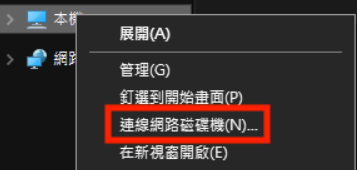
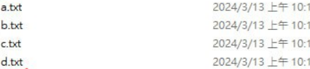

# RSA key:
## In server:
1. ``` yum install -y sshd```
2. Remove all ```.ssh``` file
```
rm -rf .ssh
```
3. ```mkdir -p .ssh```
4. Set permission
```
chmod 700 .ssh
```
## In client:
1. Remove all ```.ssh``` file
```
rm -rf .ssh
```
2. ``` ssh-keygen -t rsa -b 4096```
3. Check
```
[user@centos7-1 ~]$ cd .ssh
[user@centos7-1 .ssh]$ ls
id_rsa id_rsa.pub
```
4. Send ```id_rsa.pub``` to server:
```
scp id_rsa.pub user@192.168.208.133:/home/user/.ssh/centos7-1.pub
```
* 192.168.206.133: Server's IP address

## In server:
1. Check:
```
[user@centos7-2 ~]$ cd .ssh
[user@centos7-2 .ssh]$ ls
centos7-1.pub
```
2. Copy this to ```authorized_keys```
``` 
cat centos7-1.pub > authorized_keys
```
3. Change permission:
``` 
chmod 600 authorized_keys
```

## Login
## In client:
```
[user@centos7-1 ~]$ ssh -i /home/user/.ssh/id_rsa user@192.168.208.133
Last login: Wed Mar 13 09:22:45 2024
```
* 192.168.208.133: Server's IP address

# WEBDAP
1. ```yum install -y epel-release```
2. ``` yum install -y httpd```
3. 
```
mkdir /var/www/html/webdav
```
4. 
```
cd /var/www/html/webdav
```
5. Create Files:
```
touch {a..d}.txt
```
6. ```vim /etc/httpd/conf.d/webdav.conf```
```
DavLockDB /var/www/html/DavLock
<VirtualHost *:80>
    ServerAdmin webmaster@localhost
    DocumentRoot /var/www/html/webdav/
    ErrorLog /var/log/httpd/error.log
    CustomLog /var/log/httpd/access.log combined
    Alias /webdav /var/www/html/webdav
    <Directory /var/www/html/webdav>
        DAV On
        #AuthType Basic
        #AuthName "webdav"
        #AuthUserFile /etc/httpd/.htpasswd
        #Require valid-user
    </Directory>
</VirtualHost>
```
7. Set permission:
```
chmod -R 755 /var/www/html
```
8. 
```
chown -R apache:apache /var/www/html
```
9. 
```
systemctl restart httpd
```
10. Choose this



11. Folder: Type this
```
http://[your_IP_address]/webdav
```
12. Successful:


