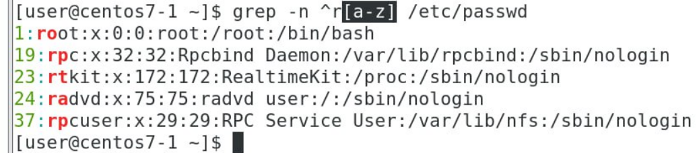

# WildCard
## The purpose of wildcards is to obfuscate certain indeterminate characters in the wildcard file name when querying.
There are 3 wildcards in Bash: ```*``` , ```?``` , ```[]```
* ```?``` :  Matches any single character
* ```*``` : Matches any character of any length
* ```[]``` : Match a range of single characters, e.g. [a-z], [0-9]

Example 1:
```
[user@centos7-1 ~]$ ls a*
a aa ab acd
```
Example 2:
```
[user@centos7-1 ~]$ touch a1 a2 a3
[user@centos7-1 ~]$ touch a11 a12 a23
[user@centos7-1 ~]$ ls a[1-9]
a1 a2 a3 
[user@centos7-1 ~]$ ls a[^1-9]
aa ab ac
[user@centos7-1 ~]$ ls a[1-9][1-9]
a11 a12 a23 
```
Example 3:
```
[user@centos7-1 ~]$ ls a[[:upper:]][[:upper:]]
aAB
[user@centos7-1 ~]$ ls a[[:upper:]][[:lower:]]
aAz
[user@centos7-1 ~]$ ls a[[:lower:]]
aa ab ac

```

# Regular Expression:
```
grep -n nologin$ /etc/passwd 
```


## awk
```
grep nologin$ /etc/passwd | awk -F: '{print $1}'
```
* {print $1}: print the first collumn before ```:```


## More example:
```
grep -n ^r. /etc/passwd
```


```
grep -n ^r.. /etc/passwd
```


```
grep -n ^r.* /etc/passwd
```


```
grep -n ^ro* /etc/passwd
```


```
grep -n ^r[a-z] /etc/passwd
```

