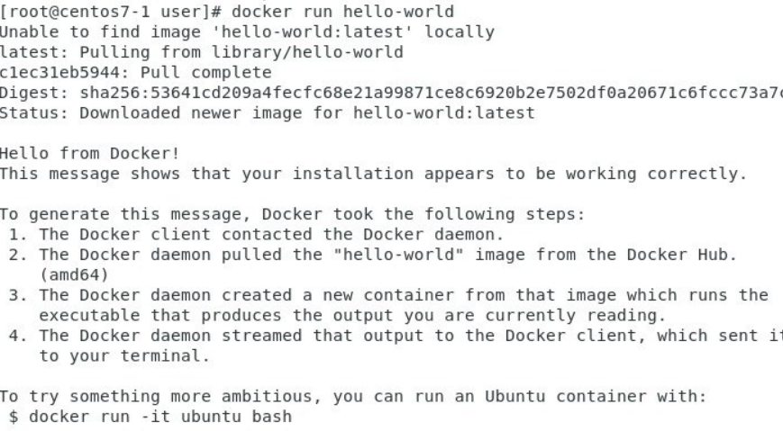

# DOCKER
## Install:
1. Set up:
```
yum install -y yum-utils

yum-config-manager --add-repo https://download.docker.com/linux/centos/docker-ce.repo
```
2. Install:
```
yum install docker-ce docker-ce-cli containerd.io docker-buildx-plugin docker-compose-plugin
```
3. Start:
```
systemctl start docker
```
## Commands:
* Show docker images:
```
docker images
```
* Show working container:
```
docker ps
```
* Run image:
```
docker run [image]
```


* Remove container:
```
docker rm container_id/name
```
```
docker rm -f 'docker ps -a -q' (remove all containers)
```
* Search docker's images:
```
docker search [image_name]
```
* Enter running container:
```
docker exec -it container_id /bin/bash
```
## Docker commit:
```
docker commit [OPTIONS] CONTAINER [REPOSITORY[:TAG]]
```
#### OPTIONS:
* ```-a``` : the author of the submitted image
* ```-c``` : use the Dockerfile command to create an image
* ```-m``` : the description of the submission
* ```-p``` : pause the container at commit