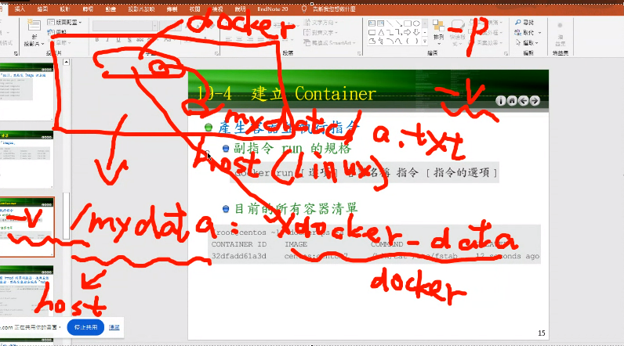
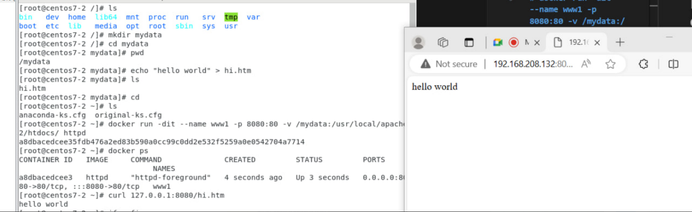
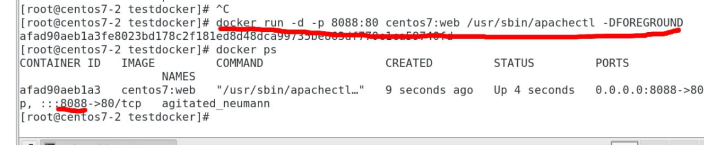
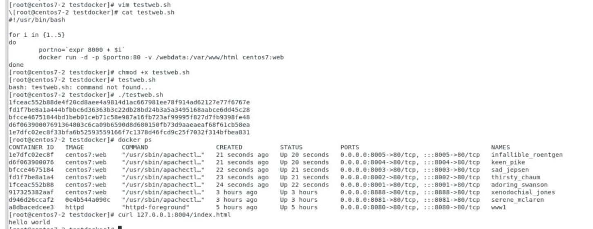

# docker pull 
# docker images
# docker rm -f 'docker ps -a -q' (remove all containers)
# docker run [.] container's name 
* -it 
* -d (daemon) 
* -p (port) 
* -v (volume)

* --name
* e (environment)
* --rm (remove container when exit)
* --restart 
* --network
##
# Host Folder with Docker
1. 
```
docker pull httpd
```
2. 
``` 
cd /
```
3. 
```
mkdir mydata
```
4. 
```
echo "helloworld" > hi.htm
cd
```
5. 
```
docker run -dit --name www1 -p 8080:80 -v /mydata:/usr/local/apache2/htdocs/ httpd
```
6.  
```
docker ps
```
7. 
```
curl 127.0.0.1:8080/hi.htm
```
# Open explorer: search: http://192.168.208.132:8080/hi.htm (192.168.208.132 is my IP (yours can be different))

# If docker doesn't have IP, use (systemctl restart docker)

# Dockerfile
1. ``` vim Dockerfile```
```
FROM centos:centos7
RUN yum -y install httpd
EXPOSE 80
ADD index.html /var/www/html
CMD ["usr/sbin/apachectl","-DFOREGROUND"]
```
2. ``` vim index.html```
```
hello world~
```
3. Build docker image:
```
docker build -t centos7:web .
```
4. Run docker image:
```
docker run -d -p 8080:80 centos7:web /usr/sbin/apachectl -DFOREGROUND
```


5. Curl:
```
curl 127.0.0.1:8088/index.html
```


# Dockerfile with Shell Script:
1. ```vim testweb.sh```
```
#!/usr/bin/bash

for i in {1..5}
do
  portno=`expr 8000 + $i`
  docker run -d -p $portno:80 -v /webdata:/var/www/html centos7:web
done
```
2. Give it execute permission:
```
chmod +x testweb.sh
```
3. Run:
```
./testweb.sh
```
4. Check ports:
```
docker ps
```
5. Curl:

