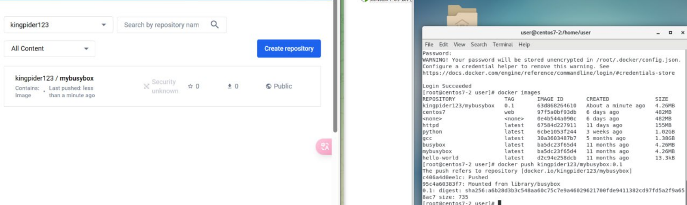
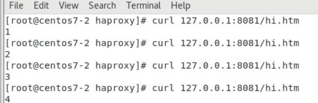
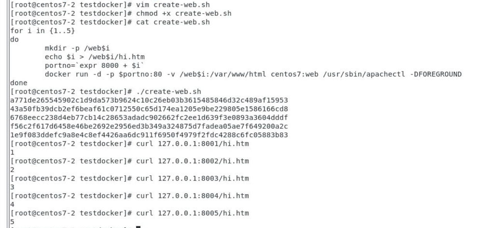

# BusyBox
1. 
```
docker pull busybox
```
2. 
```
docker run -it --rm --name test1 busybox /bin/sh
```
3. You can create files or delete files:
```
touch abc.txt
```
4. Docker commit:
```
docker commit test1 kingpider123/mybusybox:0.1
```
5. Login:
```
docker login
```
6. Push to docker hub:
```
docker push kingpider123/mybusybox:0.1
```


# Haproxy
1. Install:
```
yum install -y haproxy
```
2. Configure:
```
vim /etc/haproxy/haproxy.cfg
```
```
frontend http_front
    bind 0.0.0.0:8080
    default_backend myservers

backend myservers
    balance roundrobin
    server server1 127.0.0.1:8001
    server server2 127.0.0.1:8002
    server server3 127.0.0.1:8003
    server server4 127.0.0.1:8004
    server server5 127.0.0.1:8005
```
3. Start:
```
systemctl start haproxy
```
4. Curl:



## With docker:
1. ```vim haproxy.cfg```
```
defaults
    mode http
    timeout client 10s
    timeout connect 5s
    timeout server 10s
    tiimeout http-request 10s

frontend myfrontend
    bind 0.0.0.0:8080
    default_backend myservers

backend myservers
    balance roundrobin
    server server1 192.168.153.139:8001
    server server2 192.168.153.139:8002
    server server3 192.168.153.139:8003
    server server4 192.168.153.139:8004
    server server5 192.168.153.139:8005
```
2. Run:
```
docker run -d -p 8080:8080 --name my-haproxy -v /root/testdocker/haproxy:/usr/local/etc/haproxy:ro haproxy
```
3. Curl:


# Load Balancer with Round Robin
1. ```vim create-web.sh```
```
for i in {1..5}
do
    mkdir -p /web$i
    echo $i > /web$i/hi.htm
    portno=`expr 8000 + $i`
    docker run -d -p $portno:80 -v /web$i:/var/www/html centos7:web /usr/sbin/apachectl -DFOREGROUND
done
```
2. Give it execute permission:
```
chmod +x create-web.sh
```
3. Run
```
./create-web.sh
```
4. Curl:


# Docker network
```docker network create -d bridge mybr```

