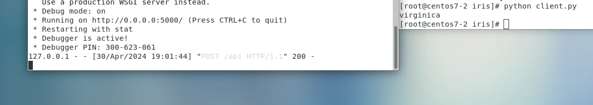

# IRIS
1. Create iris directory
2. In iris directory, create ``` train_model.py ``` file
```
# coding: utf-8
import pickle
from sklearn import datasets
from sklearn.model_selection import train_test_split
from sklearn import tree

# simple demo for traing and saving model
iris=datasets.load_iris()
x=iris.data
y=iris.target

#labels for iris dataset
labels ={
  0: "setosa",
  1: "versicolor",
  2: "virginica"
}

x_train, x_test, y_train, y_test = train_test_split(x, y, test_size=.25)
classifier=tree.DecisionTreeClassifier()
classifier.fit(x_train,y_train)
predictions=classifier.predict(x_test)

#export the model
model_name = 'model.pkl'
print("finished training and dump the model as {0}".format(model_name))
pickle.dump(classifier, open(model_name,'wb'))
```
3. Install the required module
```
yum install python-pip
python -m pip install pip==20.3.4
pip install sklearn==
```
4. Run the file
```
python train_model.py 
```
5. This time you will see, inside iris directory, there would be ```model.pkl``` and ```train_model.py``` file

6. Create ```server.py``` file
```
import pickle

from flask import Flask, request, jsonify

app = Flask(__name__)

# Load the model
model = pickle.load(open('model.pkl', 'rb'))
labels = {
  0: "versicolor",
  1: "setosa",
  2: "virginica"
}

@app.route('/api', methods=['POST'])
def predict():
    # Get the data from the POST request.
    data = request.get_json(force = True)
    predict = model.predict(data['feature'])
    return jsonify(predict[0].tolist())

if __name__ == '__main__':
    app.run(debug = True, host = '0.0.0.0')
```
7. Create ```client.py``` file
```
# coding: utf-8
import requests
# Change the value of experience that you want to test
url = 'http://127.0.0.1:5000/api'   
feature = [[5.8, 4.0, 1.2, 0.2]]
labels ={
  0: "setosa",
  1: "versicolor",
  2: "virginica"
}

r = requests.post(url,json={'feature': feature})
print(labels[r.json()])
```
8. Run ``` python server.py ```. And open new window, run ``` python client.py ```


# IRIS with Docker
1. Install necessity
```
docker pull nitincypher/docker-ubuntu-python-pip
```
2. In iris directory, create ```Dockerfile``` 
```
gedit Dockerfile
```
3. Dockerfile's content
```
FROM nitincypher/docker-ubuntu-python-pip

COPY ./requirements.txt /app/requirements.txt

WORKDIR /app

RUN pip install -r requirements.txt

COPY server.py /app

COPY train_model.py /app

CMD python /app/train_model.py && python /app/server.py
```
4. In iris directory, create ```requirements.txt```. Its content is below:
```
sklearn
flask
```
5. Next step is docker build.
```
[root@centos iris]# docker build -t iris:1.0 .
```
6. Docker run:
```
[root@centos iris]# docker run -itd --name iris -p 5000:5000 iris:1.0
```
7. Test:
```
[root@centos iris]# python run client.py
```
# Use GitLab to create CI/CD (Need to create Gitlab account and 2 virtual machines)
1. First step is to add SSH Keys:
    * Both virtual machines:

Commands:
```
ssh-keygen  
cd .ssh 
cat id_rsa.pub (Copy the string)
```