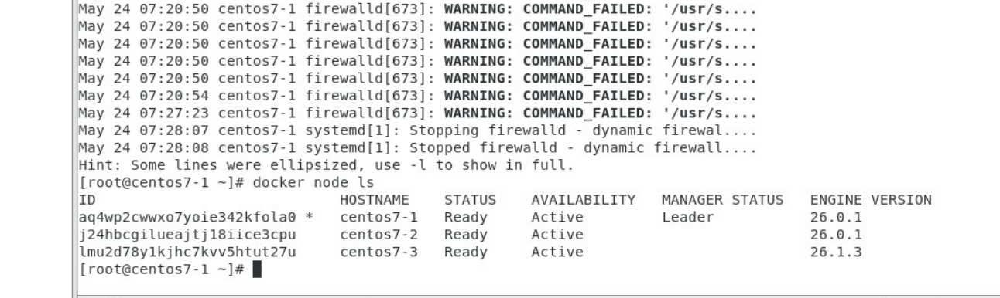
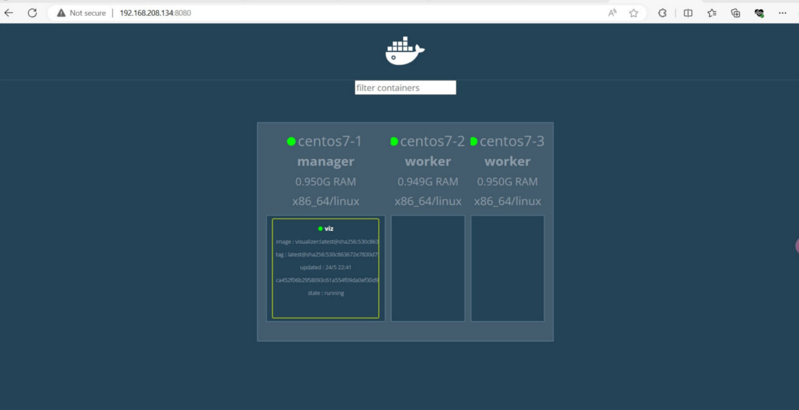
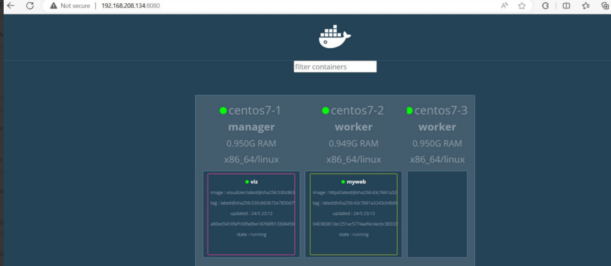
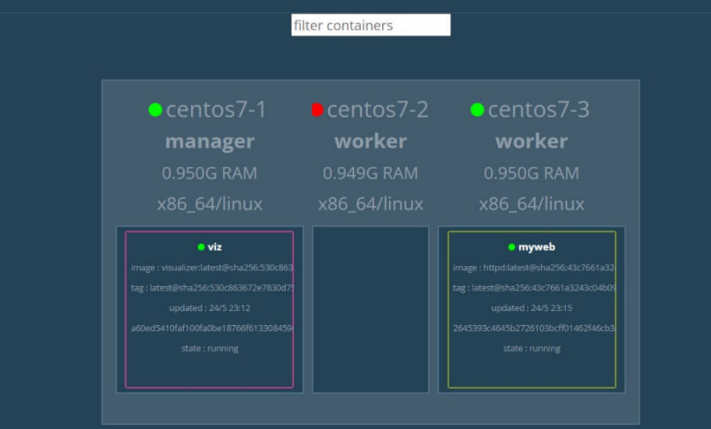
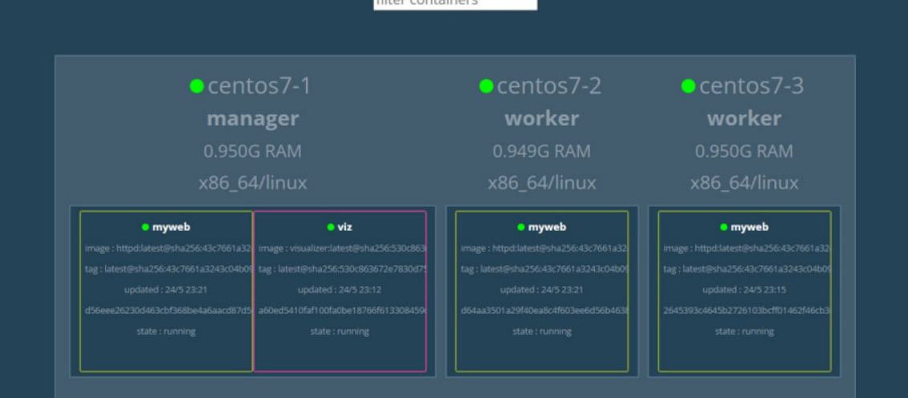
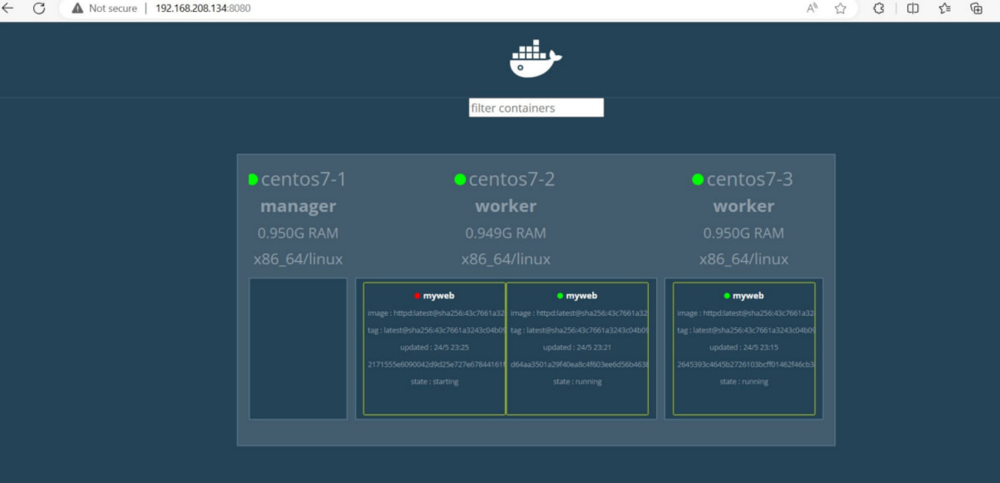
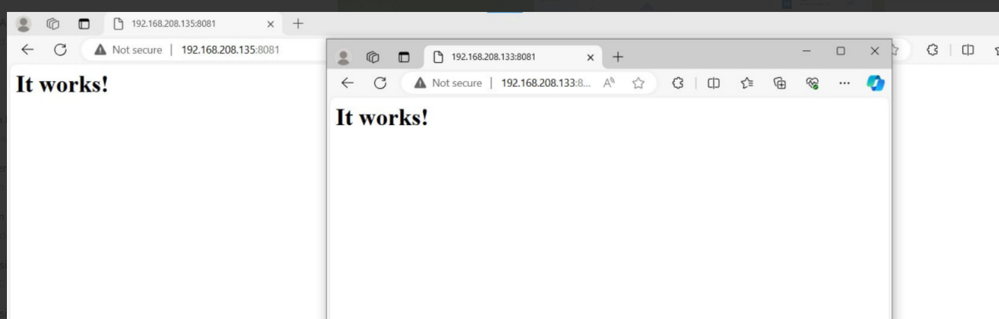

# Docker Swarm
You want to have 3 virtual machines with different names (centos7-1, centos7-2, centos7-3)
```
centos7-1 will be assigned as master node( manager) , the rest will be worker nodes
```
```
Master node will assign the work to other nodes.
```
1. Initialization:
```
docker swarm init --advertise-addr 192.168.208.134 (depend on your master's node IP)
```
2. Join Swarm: (worker nodes)
```
Copy this line(yours may be different):

docker swarm join --token SWMTKN-1-4na491msdpiqiu9xfqwft6qzmqe0fn1yrwtv9y185se05s166o-dlwhc5ri30616bb4juiqgjcxl 192.168.208.134:2377
```
3. Check Swarm status:
```
docker node ls
```

4. Visualization:
```
docker service create --name=viz --publish=8080:8080/tcp --constraint=node.role==manager --mount=type=bind,src=/var/run/docker.sock,dst=/var/run/docker.sock dockersamples/visualizer
```

5. Create service
```
docker service create --name myweb https
```
** This will create ```myweb``` service to one of your worker nodes.

6. If the worker node is down, the service will automatically change to the another node.

7. Copying service (expanding):
```
docker service scale myweb=3
```
** This will give 3 nodes ```myweb``` service

8. Make the node reject any works:
```
docker node update --availability drain centos7-1
```

9. Make it active again by using:
```
docker node update --availability active centos7-1
```
10. Make the services can be connected outside
```
docker service create --name myweb --replicas 3 httpd
```
```
docker service update --publish-add 8081:80 myweb
```


# Want to delele service:
```
docker service rm myweb (depends on your service name)
```
# Want to know services list:
```
docker service ls
```