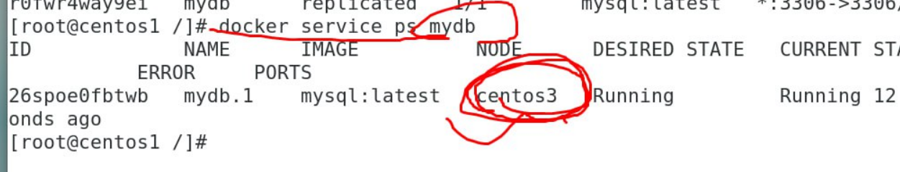
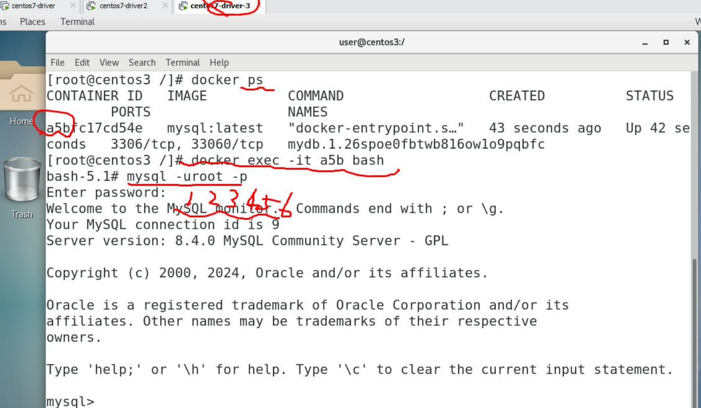

# Docker Swarm with Database
1. Make sure all your nodes are ready
```
docker node ls
```
2. Create two directories in your master node:
```
cd /
mkdir /mydb
mkdir /myphp
```
3. Install necessity:
```
yum install nfs-utils
```
4. Start nfs:
```
systemctl start rpcbind
systemctl start nfs
```
5. Check your master node's IP and do this:
```
vim /etc/exports
```


6. Restart nfs:
```
systemctl restart rpcbind
systemctl restart nfs
```
7. Check:
```
showmount -e local host
```


8. Use ```mount``` at worker nodes:


9. At MASTER node, create network:
```
docker network create -d overlay mynet
```
** This time, in WORKER nodes you will be able to see ```mynet```


10. Create database service:
```
docker service create --name mydb --network mynet --mount type=bind,source=/mydb,target=/var/lib/mysql --env MYSQL_ROOT_PASSWORD=123456 --publish published=3306,target=3306 mysql
```
** If success, you can check:

11. Check which node the service has been assigned to:
```
docker service ps mydb
```


12. In that worker node, enter mysql:


13. Create database:
```
create database testdb;
```


** The database you have just created will not be deleted even if you remove ```mydb``` service

14. Create new database and insert info in mysql:
```
create database testsql;
use testsql;
create table testtable(school char(5),name char(10),id int);
insert into testtable(school, name, id) values ('NQU','Jerry','123');
insert into testtable values ('NCTU','Amy','234');
```

** You can exit mysql if you have already finished step 14

15. Go back to master node and create ```test.php``` in ```myphp```
```
cd /myphp
vim test.php
``` 
```
<?php
$servername="mydb";
$username="root";
$password="123456";
$dbname="testsql";

$conn = new mysqli($servername, $username, $password, $dbname);

if($conn->connect_error){
	die("connecttion failed: " . $conn->connect_error);
}
else{
	echo "connect ok!" . "<br>";
}

$sql="select * from testtable";
$result=$conn->query($sql);

if($result->num_rows>0){
	while($row=$result->fetch_assoc()){
		echo "school: " . $row["school"] . "\tname: " . $row["name"] . "\tid: " . $row["id"] . "<br>";
	}
}else {
	echo "0 record";
}
?>
```


16. Create ```myphp``` service:
```
docker service create --name myphp --network mynet --mount type=bind,source=/myphp,target=/var/www/html --publish published=8888,target=80 radys/php-apache:7.4
```

17. This time you can use ```curl``` with your IP:


## If curl is freezing you can check location of the service to see which node, and then go to the node: use ```docker exec -it ... bash``` and then use ```ls``` to check if ```test.php``` is created in /var/www/html 