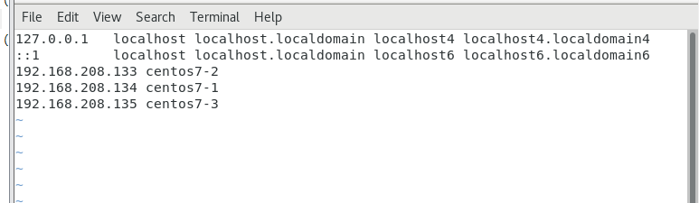

# ANSIBLE
*** PREPARE 3 VIRTUAL MACHINES
1. Do no-password login in centos7-1
```
ssh-keygen
```
2. Instead of IP, we change to name:
```
vim /etc/hosts
```


3. Next step:
```
[root@centos7-1 ~]# ssh-copy-id root@centos7-2
[root@centos7-1 ~]# ssh-copy-id root@centos7-3
```
4. Connect successfully:
```
[root@centos7-1 ~]# ssh root@centos7-2
Last login: Tue May 28 19:32:22 2024 from centos7-1
[root@centos7-2 ~]# exit
logout
Connection to centos7-2 closed.
```
5. Install ```epel-release```:
```
yum install -y epel-release
```
6. Install Ansible:
```
yum install -y ansible
```
7. Set up hosts:
```
gedit /etc/ansible/hosts
```
```
[server1]
192.168.208.133  # centos7-2
[server2]
192.168.208.135  # centos7-3

[servers]
192.168.208.133
192.168.208.135
```
8. Test:``` ansible server1 -m ping```
```
[root@centos7-1 ~]# ansible server1 -m ping
192.168.208.133 | SUCCESS => {
    "ansible_facts": {
        "discovered_interpreter_python": "/usr/bin/python"
    }, 
    "changed": false, 
    "ping": "pong"
}
```
-------------------------------
1. Create ```test1.yml``` inside this:
```
/root/test-ansible
└── test1
    └── test1.yml
```
2. ``` gedit test1.yml```
```
---
- hosts: server1
  tasks:
    - name: test ping
      ping:
```
3. ```ansible-playbook```
```
[root@centos7-1 test1]# ansible-playbook test1.yml

PLAY [server1] *******************************************************************

TASK [Gathering Facts] ***********************************************************
ok: [192.168.208.133]

TASK [test ping] *****************************************************************
ok: [192.168.208.133]

PLAY RECAP ***********************************************************************
192.168.208.133            : ok=2    changed=0    unreachable=0    failed=0    skipped=0    rescued=0    ignored=0   
```