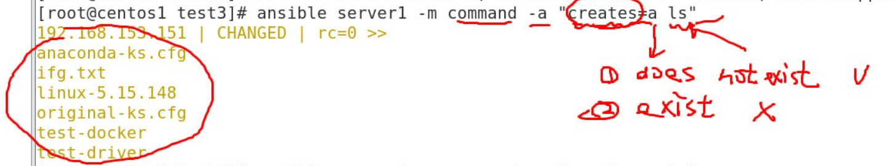
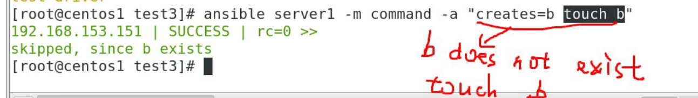
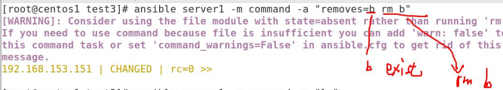
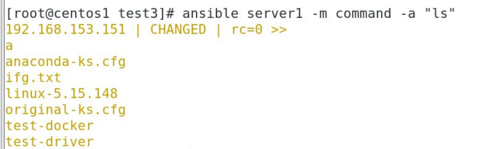
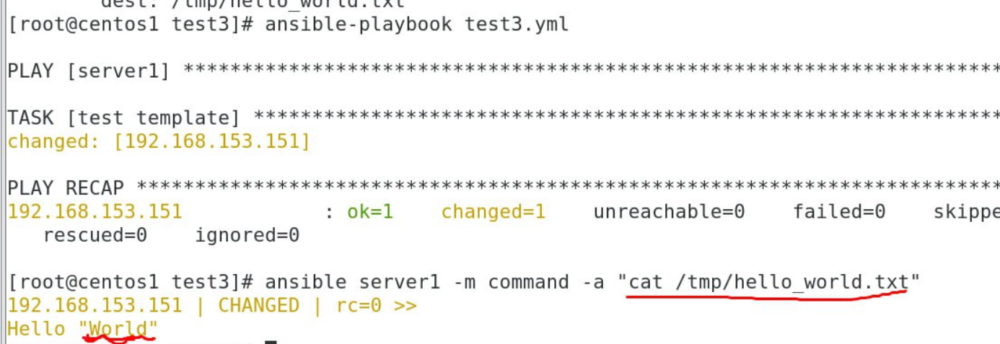

# ANSIBLE + ubuntu
*** PREPARE 3 VIRTUAL MACHINES (2 centos + 1 ubuntu)
## In ubuntu:
1. Install ssh:
```
apt install openssh-server
```
2. Start ssh:
```
systemctl start ssh
```
3. Configure:
```
vim /etc/ssh/sshd_config
```
```
PermitRootLogin yes
```
## In centos7-1:
1. ``` vim /etc/ansible/hosts```
```
[server1]
192.168.208.138 #centos7-2
[server2]
192.168.208.135 #ubuntu
```
2. Ansible Ping:
```
ansible all -m ping
```
# ANSIBLE command:
* Example 1:
```
ansible server1 -m command -a "creates=a ls"
```

* Example 2:
```
ansible server1 -m command -a "creates=b touch b"
```

* Example 3:
```
ansible server1 -m command -a "removes=b rm b"
```

* Example 4:
```
ansible server1 -m command -a "ls"
```


# ANSIBLE with template:
1. Create 2 files: ```hi.j2```, ```test3.yml```
```
echo 'Hello "{{ dynamic_world }}"' > hi.j2
```
```
vim test3.yml
```
```
---
- hosts: server1
  gather_facts: no
  vars:
    dynamic_world: "World"
  tasks:
    - name: test template
      template:
        src: hi.j2
        dest: /tmp/hello_world.txt
```
2. Ansible playbook:
```
ansible-playbook test3.yml
```
3. 
```
ansible server1 -m command -a "cat /tmp/hello_world.txt"
```
