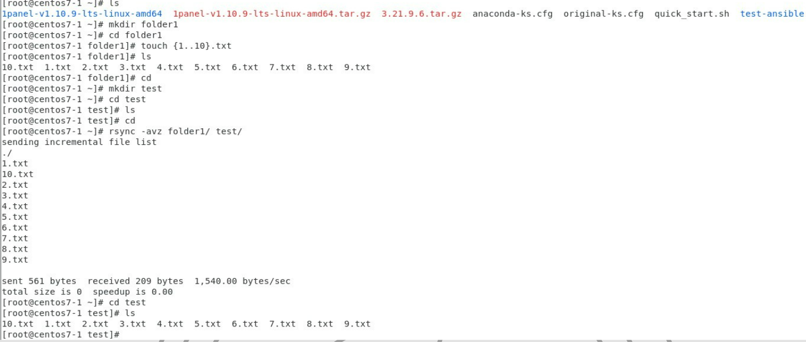
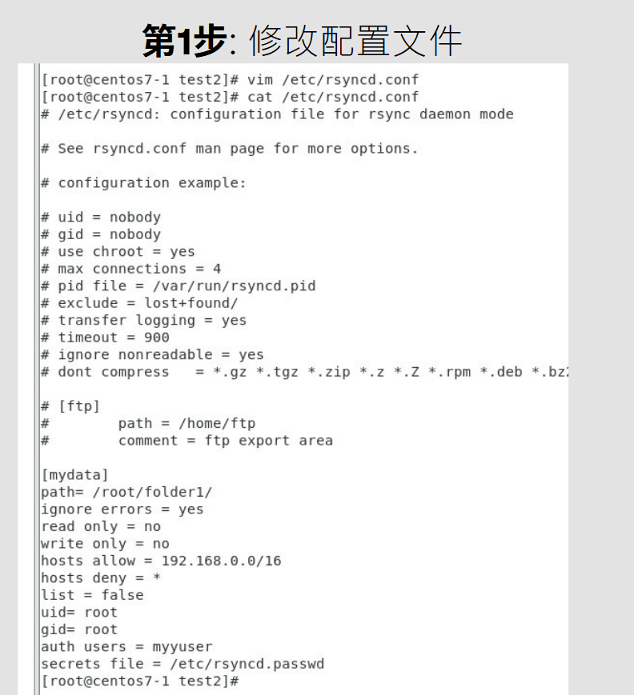

# RSYNC
## Rsync is a fast, versatile, remote (and local) file-copying tool
## Install:
```
yum install -y rsync
```
## Format:
* Local:
```
rsync [OPTION...] SRC... [DEST]
```

* Access via remote shell:
```
Pull: rsync [OPTION...] [USER@]HOST:SRC... [DEST]
```

```
Push: rsync [OPTION...] SRC... [USER@]HOST:DEST
```

* Access via rsync daemon:
```
Pull: rsync [OPTION...] [USER@]HOST::SRC... [DEST]
      rsync [OPTION...] rsync://[USER@]HOST[:PORT]/SRC... [DEST]
Push: rsync [OPTION...] SRC... [USER@]HOST::DEST
      rsync [OPTION...] SRC... rsync://[USER@]HOST[:PORT]/DEST
```
1. Step 1:


2. Step 2:

3. Step 3:

4. Step 4:

5. RSYNC with typing password:

6. RSYNC without typing password:

* ```OPTION```:
```
-v, --verbose: increase verbosity
```
```
-a, --archive: archive mode; equals -rlptgoD (no -H,-A,-X)
```
```
-r, --recursive: recurse into directories
```
```
-z, --compress: compress file data during the transfer
```
```
-p, --perms: preserve permissions
```
# INOTIFY:
## Inotify's function: monitoring file system events
## The  inotify API provides a mechanism for monitoring file system events.  Inotify can be used to monitor individual files, or to monitor directories.  When a directory is moni‐tored, inotify will return events for the directory itself, and for files inside the directory.
## Install:
1.
```
wget -c https://github.com/inotify-tools/inotify-tools/archive/refs/tags/3.21.9.6.tar.gz
```
2.
```
tar -zvxf 3.21.9.6.tar.gz -C /usr/local/src/
```
3.
```
cd /usr/local/src/inotify-tools-3.21.9.6/
```
4. 
```
/autogen.sh && ./configure --prefix=/usr/local/inotify-tools && make && make install
```


5. Add to environment variable:

 

## Inotifywait
* OPTIONS:
```
-m (monitor): Monitors changes in the target path and runs continuously until manually terminated
```
```
-d (daemonize): Runs in daemonize mode, which is suitable for long-running monitoring tasks.
```
```
-r (recursive): recursively monitors all subdirectories in the target path.
```
```
-q (quiet): Silent mode, only output change events, no start and end information.
```
```
--exclude : Use regular expressions to exclude specific documents or directories (case-sensitive).
```
```
--excludei : Use regular expressions to exclude specific documents or directories (case insensitive).
```
```
-o (outfile): Writes the output to the specified file, not standard output.
```
```
-s (syslog): Writes the output to the syslog instead of the standard output
```
```
--timefmt : Specifies the timestamp format to --format be used with .
```
```
--format : Customize the output format, which can include time, event type, file name, etc.
```
```
-e (event): Specifies the type of event to be monitored (such as create, delete, modify, etc.).
```
* Example:
```
inotifywait -mrq --timefmt "%F %T" --format '%T %w%f %e' -e create,delete ./folder1/
```

```
--timefmt:
    %T : The timestamp specified in the –timefmt format
    %w : the name of the monitored directory
    %f: The name of the file that has changed
    %e: The type of event that occurred 
```
```
-e <event>:
    create : Triggered when a file or directory is created
    delete : Triggered when a file or directory is deleted
    moved_to : Triggered when a file or directory is moved to the monitored directory
    close_write : Triggered when a file that is open for writing is closed
    attrib : Triggered when a file or directory property is modified. Attributes include permissions, owners, timestamps, and more.
```
## Inotifywait with shell script:
1. ```vim checkfile.sh```
```
#!/bin/bash
#
prog="inotifywait"
events="create,delete,modify,attrib"
iopt="-mrq"

lpath=./folder1/"
$prog $iopt --format "%w%f %e" -e $events $lpath | while read line
do
    echo $line
done
```
2. Give it execute permission:
```
chmod +x checkfile.sh
```
3. Run:
```
./checkfile.sh
```


# RSYNC + INOTIFY 
1. ```First Step```:


2. ``` Second Step```:

